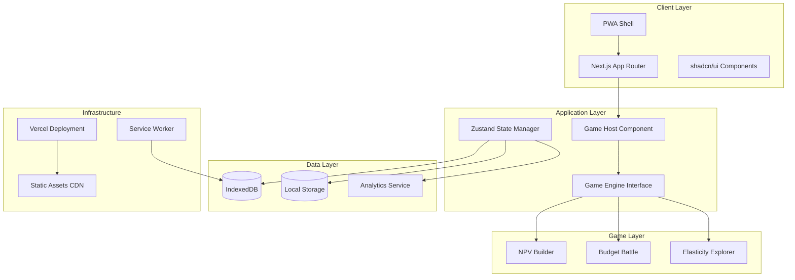
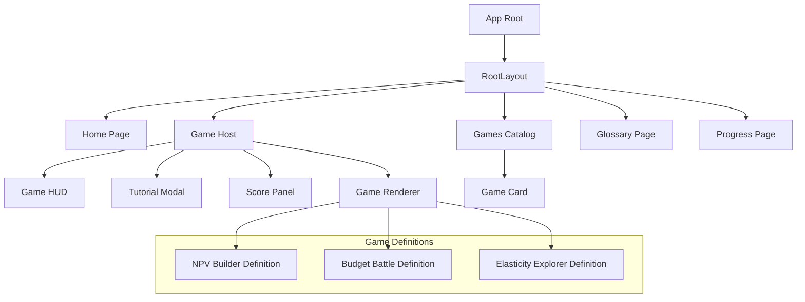

# Design Document

## Overview

Finance Arcade is a production-ready, responsive web application that teaches finance concepts through interactive mini-games. The application follows a modular architecture built with Next.js 14 (App Router), TypeScript, Tailwind CSS, shadcn/ui, and Zustand for state management. The system is designed to be accessible, performant, and deployable as a PWA on Vercel.

### Key Design Principles
- **Modular Game Engine**: Reusable architecture supporting multiple finance games
- **Responsive Design**: Mobile-first approach supporting all device types
- **Accessibility First**: WCAG 2.1 AA compliance with keyboard navigation
- **Performance Optimized**: Code-splitting, lazy loading, and PWA capabilities
- **Educational Effectiveness**: Clear learning objectives and progress tracking
- **Privacy-Conscious**: Local-first data storage with optional analytics

## Architecture

### High-Level System Architecture



### Technology Stack Migration Plan

The current implementation uses React with Create React App and styled-components. The design will migrate to:

- **Framework**: Next.js 14 with App Router for better performance and SEO
- **Styling**: Tailwind CSS + shadcn/ui for consistent design system
- **State Management**: Zustand for lightweight, TypeScript-friendly state management
- **Testing**: Vitest + Playwright for comprehensive testing coverage
- **Deployment**: Vercel with PWA configuration

## Components and Interfaces

### Core Game Engine Interface

```typescript
export type LearningObjective = {
  id: string;
  text: string;        // e.g., "Compute NPV with discounting"
  rubric: string[];    // bullet criteria for mastery
};

export type GameEvent =
  | { type: 'start' }
  | { type: 'action'; name: string; payload?: unknown }
  | { type: 'hint' }
  | { type: 'complete'; passed: boolean; score: number }
  | { type: 'quit' };

export type GameState = {
  level: number;
  score: number;
  timeMs: number;
  mistakes: number;
};

export type GameDefinition = {
  id: string;
  title: string;
  summary: string;
  estimatedTimeMin: number;
  objectives: LearningObjective[];
  controls: { mouse: boolean; touch: boolean; keyboard: boolean };
  tutorialSteps: string[]; // short, stepwise
  levels: number;
  init: () => GameState;
  update: (state: GameState, event: GameEvent) => GameState;
  render: (state: GameState) => React.ReactNode; // pure UI from state
  assessMastery: (state: GameState) => boolean; // objective mastery
};
```

### Component Architecture



### State Management Design

```typescript
// Zustand Store Structure
interface AppStore {
  // User state
  user: User | null;
  setUser: (user: User) => void;

  // Game state
  currentGame: GameDefinition | null;
  gameState: GameState | null;
  setCurrentGame: (game: GameDefinition) => void;
  updateGameState: (update: Partial<GameState>) => void;

  // Progress tracking
  gameProgress: Record<string, GameProgress>;
  updateGameProgress: (gameId: string, progress: GameProgress) => void;

  // Analytics
  trackEvent: (event: AnalyticsEvent) => void;

  // Persistence
  saveToStorage: () => Promise<void>;
  loadFromStorage: () => Promise<void>;
}
```

## Data Models

### User and Progress Models

```typescript
interface User {
  id: string;
  username: string;
  xp: number;
  level: number;
  achievements: Achievement[];
  financeConceptsCompleted: string[];
  createdAt: Date;
  updatedAt: Date;
}

interface GameProgress {
  gameId: string;
  level: number;
  highScore: number;
  timesPlayed: number;
  mastered: boolean;
  lastPlayed: Date;
  objectives: Record<string, boolean>; // objective_id -> mastered
}

interface GameSession {
  id: string;
  gameId: string;
  userId: string;
  score: number;
  duration: number; // milliseconds
  level: number;
  events: GameEvent[];
  timestamp: Date;
}
```

### Game-Specific Data Models

#### NPV Builder Data Models
```typescript
interface NPVBuilderState extends GameState {
  cashFlows: CashFlow[];
  discountRate: number;
  currentProject: Project;
  availableProjects: Project[];
  calculatedNPV: number;
  decision: 'invest' | 'reject' | 'indifferent' | null;
}

interface CashFlow {
  id: string;
  year: number;
  amount: number;
  isPlaced: boolean;
  position?: { x: number; y: number };
}

interface Project {
  id: string;
  name: string;
  cashFlows: number[];
  timeline: number[];
}
```

#### Budget Battle Data Models
```typescript
interface BudgetBattleState extends GameState {
  monthlyIncome: number;
  categories: BudgetCategory[];
  events: BudgetEvent[];
  currentRound: number;
  totalRounds: number;
  cashBuffer: number;
  savingsGoal: number;
  constraints: BudgetConstraint[];
}

interface BudgetCategory {
  id: string;
  name: string;
  type: 'fixed' | 'variable';
  allocated: number;
  spent: number;
  priority: 1 | 2 | 3;
}

interface BudgetEvent {
  id: string;
  title: string;
  description: string;
  impact: number;
  category?: string;
  type: 'income' | 'expense';
}
```

#### Elasticity Explorer Data Models
```typescript
interface ElasticityExplorerState extends GameState {
  demandCurve: DemandPoint[];
  currentPrice: number;
  currentQuantity: number;
  elasticity: number;
  revenue: number;
  marginalRevenue: number;
  quests: ElasticityQuest[];
  completedQuests: string[];
}

interface DemandPoint {
  price: number;
  quantity: number;
  elasticity?: number;
  revenue?: number;
}

interface ElasticityQuest {
  id: string;
  title: string;
  description: string;
  target: {
    elasticity?: number;
    elasticityRange?: [number, number];
    pricePoint?: number;
    revenueTarget?: number;
  };
  completed: boolean;
}
```

## Game Design Specifications

### NPV Builder Detailed Design

**UI Layout:**
- Left Panel: Cash flow card library with add/remove functionality
- Center Panel: Interactive timeline grid (year 0-10, amount -$10k to +$10k)
- Right Panel: Discount rate controls, NPV calculation display, investment decision indicator
- Bottom HUD: Timer, score, hints, tutorial access

**Core Logic:**
```typescript
function calculateNPV(cashFlows: CashFlow[], discountRate: number): number {
  return cashFlows.reduce((npv, cf) => {
    return npv + (cf.amount / Math.pow(1 + discountRate, cf.year));
  }, 0);
}

function assessInvestmentDecision(npv: number): 'invest' | 'reject' | 'indifferent' {
  if (npv > 50) return 'invest';
  if (npv < -50) return 'reject';
  return 'indifferent';
}
```

**Tutorial Flow:**
1. Introduction to time value of money concept
2. Demonstrate discount rate adjustment
3. Place first cash flow on timeline
4. Show discounting calculation
5. Calculate NPV and interpret result
6. Make investment decision

**Accessibility Features:**
- Keyboard navigation for drag-and-drop (arrow keys + space/enter)
- Screen reader announcements for NPV changes
- High contrast mode for cash flow cards
- Focus indicators on all interactive elements

### Budget Battle Detailed Design

**UI Layout:**
- Top Panel: Monthly income display, savings goal tracker
- Center Grid: Category allocation sliders with visual progress bars
- Event Panel: Random events with impact descriptions
- Bottom Dashboard: Cash flow summary, variance analysis

**Core Logic:**
```typescript
function validateBudget(categories: BudgetCategory[], constraints: BudgetConstraint[]): ValidationResult {
  const totalAllocated = categories.reduce((sum, cat) => sum + cat.allocated, 0);
  const savingsRate = categories.find(cat => cat.name === 'Savings')?.allocated || 0;

  return {
    isValid: totalAllocated <= monthlyIncome && savingsRate >= constraints.minSavings,
    violations: calculateViolations(categories, constraints)
  };
}
```

**Event System:**
- Random events trigger every 2-3 rounds
- Event types: emergency expenses, income changes, opportunity costs
- Player must rebalance budget within time limit
- Consequences affect next round's available income

### Elasticity Explorer Detailed Design

**UI Layout:**
- Main Graph: Interactive demand curve with price/quantity axes
- Side Panel: Elasticity calculation breakdown, formula display
- Quest Panel: Current objectives and progress
- Revenue Overlay: Toggle for revenue curve visualization

**Core Logic:**
```typescript
function calculatePriceElasticity(p1: number, q1: number, p2: number, q2: number): number {
  const midPrice = (p1 + p2) / 2;
  const midQuantity = (q1 + q2) / 2;
  const percentChangePx = ((p2 - p1) / midPrice) * 100;
  const percentChangeQx = ((q2 - q1) / midQuantity) * 100;
  return percentChangeQx / percentChangePx;
}

function classifyElasticity(elasticity: number): 'elastic' | 'inelastic' | 'unit' {
  const absElasticity = Math.abs(elasticity);
  if (absElasticity > 1) return 'elastic';
  if (absElasticity < 1) return 'inelastic';
  return 'unit';
}
```

## Testing Strategy

### Unit Testing Approach
- **Financial Calculations**: Test NPV, elasticity, budget validation functions
- **State Management**: Test Zustand store actions and state updates
- **Component Logic**: Test game component rendering and interaction handlers
- **Utility Functions**: Test XP calculations, level progression, data persistence

```typescript
// Example unit tests
describe('NPV Calculations', () => {
  it('should calculate NPV correctly for standard cash flows', () => {
    const cashFlows = [
      { year: 0, amount: -100 },
      { year: 1, amount: 60 },
      { year: 2, amount: 60 }
    ];
    const npv = calculateNPV(cashFlows, 0.1);
    expect(npv).toBeCloseTo(9.92, 2);
  });
});
```

### End-to-End Testing Strategy
- **Game Completion Flows**: Full playthrough of each game's first level
- **Keyboard Navigation**: Complete keyboard-only navigation for all games
- **Responsive Testing**: Device emulation for iPhone 14, Pixel 7, iPad, desktop
- **Offline Functionality**: Test NPV Builder offline capabilities
- **Performance Testing**: Lighthouse CI integration with score thresholds

```typescript
// Example E2E test
test('NPV Builder keyboard navigation', async ({ page }) => {
  await page.goto('/games/npv-builder');
  await page.keyboard.press('Tab'); // Focus first cash flow input
  await page.keyboard.type('100');
  await page.keyboard.press('Tab');
  await page.keyboard.type('1');
  await page.keyboard.press('Enter'); // Place cash flow
  // ... continue test flow
});
```

### Performance Testing
- **Lighthouse CI**: Automated performance audits on every PR
- **Bundle Analysis**: Monitor bundle size and code splitting effectiveness
- **Runtime Performance**: Memory usage and rendering performance metrics
- **Accessibility Testing**: Automated axe-core accessibility scans

## Error Handling

### Error Boundary Strategy
```typescript
class GameErrorBoundary extends React.Component<Props, State> {
  static getDerivedStateFromError(error: Error): State {
    return {
      hasError: true,
      error: error.message,
      gameId: this.props.gameId
    };
  }

  componentDidCatch(error: Error, errorInfo: ErrorInfo) {
    console.error('Game Error:', error, errorInfo);
    this.trackError(error, this.props.gameId);
  }

  render() {
    if (this.state.hasError) {
      return <GameErrorFallback onRetry={this.handleRetry} />;
    }
    return this.props.children;
  }
}
```

### Graceful Degradation
- **WebGL/Canvas Fallback**: HTML/CSS-based UI when advanced graphics unavailable
- **IndexedDB Fallback**: Use localStorage when IndexedDB not supported
- **Touch/Mouse Fallback**: Ensure all interactions work with basic input methods
- **Network Offline**: Service worker provides offline functionality for core features

## Accessibility Implementation

### WCAG 2.1 AA Compliance Strategy

**Keyboard Navigation:**
- All interactive elements accessible via Tab navigation
- Custom focus management for complex components (drag-and-drop)
- Escape key closes modals, Enter/Space activates controls
- Arrow keys for game-specific navigation (timeline movement, graph navigation)

**Screen Reader Support:**
- Semantic HTML structure with proper headings hierarchy
- ARIA labels for dynamic content and game states
- Live regions for score updates and game events
- Role attributes for custom game components

**Visual Accessibility:**
- Color contrast ratios ≥ 4.5:1 for all text
- Focus indicators clearly visible on all interactive elements
- Support for prefers-reduced-motion for animations
- High contrast mode compatibility

**Motor Accessibility:**
- Large touch targets (minimum 44px) for mobile devices
- Drag-and-drop alternatives using keyboard
- Adjustable timing for time-sensitive game elements
- Sticky drag for users with motor difficulties

## Analytics and Telemetry

### Privacy-First Analytics Design
```typescript
interface AnalyticsEvent {
  type: 'game_start' | 'level_complete' | 'hint_used' | 'quit' | 'concept_mastered';
  gameId: string;
  level?: number;
  score?: number;
  timeMs?: number;
  mastery?: boolean;
  sessionId: string;
  timestamp: number;
}

class AnalyticsService {
  private hasConsent: boolean = false;
  private eventQueue: AnalyticsEvent[] = [];

  requestConsent(): Promise<boolean> {
    // Show consent dialog
    // Return user's choice
  }

  track(event: AnalyticsEvent): void {
    if (!this.hasConsent) {
      this.eventQueue.push(event);
      return;
    }
    this.sendEvent(event);
  }
}
```

### Educational Metrics
- **Learning Objective Mastery**: Track completion of specific finance concepts
- **Time on Task**: Measure engagement and difficulty assessment
- **Hint Usage Patterns**: Identify areas where students need additional support
- **Drop-off Points**: Understand where students disengage
- **Progression Patterns**: Analyze learning pathways and game preferences

## Deployment Architecture

### Vercel Configuration
```json
{
  "version": 2,
  "builds": [
    {
      "src": "package.json",
      "use": "@vercel/next"
    }
  ],
  "headers": [
    {
      "source": "/sw.js",
      "headers": [
        {
          "key": "Cache-Control",
          "value": "no-cache"
        }
      ]
    },
    {
      "source": "/(.*)",
      "headers": [
        {
          "key": "X-Frame-Options",
          "value": "SAMEORIGIN"
        }
      ]
    }
  ]
}
```

### PWA Configuration
- **Service Worker**: Cache game assets and enable offline play for NPV Builder
- **Web App Manifest**: Enable installation on mobile devices and desktop
- **Background Sync**: Queue analytics events when offline
- **Cache Strategy**: Stale-while-revalidate for game assets, network-first for user data

### Performance Optimization
- **Code Splitting**: Route-based and component-based splitting
- **Lazy Loading**: Game definitions loaded on demand
- **Image Optimization**: Next.js Image component with responsive sizing
- **Bundle Analysis**: Regular monitoring of bundle size and dependencies

## Security Considerations

### Data Protection
- **Local Storage Encryption**: Sensitive user data encrypted before storage
- **HTTPS Only**: All communications over secure connections
- **XSS Prevention**: Content Security Policy and input sanitization
- **CSRF Protection**: Next.js built-in CSRF protection

### Content Security
- **Asset Integrity**: Subresource integrity for external dependencies
- **Input Validation**: Zod schemas for all user inputs
- **Error Information**: Sanitized error messages to prevent information leakage

## Migration Strategy

### Phase 1: Infrastructure Migration
1. Set up Next.js 14 project structure
2. Implement core game engine interface
3. Create basic component library with shadcn/ui
4. Set up Zustand state management
5. Configure build and deployment pipeline

### Phase 2: Game Implementation
1. Migrate existing game logic to new architecture
2. Implement NPV Builder with full feature set
3. Implement Budget Battle with tutorial system
4. Implement Elasticity Explorer with interactive graphs
5. Add comprehensive testing coverage

### Phase 3: Enhancement and Optimization
1. PWA implementation with offline capabilities
2. Advanced accessibility features
3. Performance optimization and monitoring
4. Analytics integration with consent management
5. Production deployment and monitoring

This design provides a comprehensive foundation for building the Finance Arcade application according to the PRD specifications while maintaining high standards for accessibility, performance, and educational effectiveness.